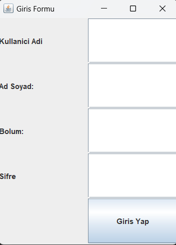
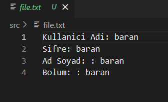

<h1>Application to write user information to file</h1>
<h2>What are we aiming for in this applications?</h2>
<pre>
In my application, I am using Swing to perform the task of saving user input a text file. To accomplish this,I am utilizing Java's Object-Oriented Programming capabilities. 
</pre>

<h2>Tech I use:</h2>

<h2>Features offered in this application: </h2>
<pre>Username, </pre>
<pre>Password, </pre>
<pre>Full Name, </pre>
<pre>Department. </pre>
These fields are presented to the user, and the necessary operations are handled simply when registering for any social media platform or website. Instead of using a database, data is save to a file. 

<h2>Screenshoot:</h2>
 

You can reach me through my social media accounts listed on my profile. Have a good day!👋

